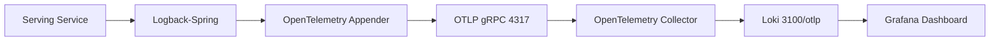

# Serving Service 모듈

## 개요
OpenTelemetry 스터디 프로젝트의 Serving Service 모듈입니다. Micrometer 기반의 관측 가능성(Observability) 구현을 통해 분산 추적, 메트릭 수집, 로그 전송 기능을 제공합니다.

## 주요 기능
- **분산 추적**: Micrometer를 통한 OpenTelemetry 트레이스 생성 및 전송
- **메트릭 수집**: OTLP 및 Prometheus 형식의 메트릭 수집
- **로그 전송**: OTLP 프로토콜을 통한 중앙 집중식 로그 관리
- **서비스 디스커버리**: Eureka를 통한 마이크로서비스 등록 및 발견

## 기술 스택
- **Spring Boot**: 애플리케이션 프레임워크
- **Spring Web**: RESTful API 제공
- **Eureka Client**: 서비스 디스커버리 클라이언트
- **Micrometer**: 메트릭 및 트레이싱 추상화 라이브러리
- **OpenTelemetry**: 분산 추적 표준

## 관측 가능성 구성

### 1. 분산 추적
```gradle
implementation 'io.micrometer:micrometer-tracing-bridge-otel'
```
- Micrometer의 트레이싱 추상화를 OpenTelemetry 구현체로 연결
- 자동 트레이스 ID 및 스팬 ID 생성
- MDC(Mapped Diagnostic Context)를 통한 로그와 트레이스 연동

### 2. 메트릭 수집
```gradle
runtimeOnly 'io.micrometer:micrometer-registry-otlp'      // OTLP 프로토콜 전송
runtimeOnly 'io.micrometer:micrometer-registry-prometheus' // Prometheus 메트릭 노출
```
- **OTLP 방식**: Push 방식으로 OpenTelemetry Collector에 메트릭 전송
- **Prometheus 방식**: Pull 방식으로 `/actuator/prometheus` 엔드포인트 노출

### 3. 로그 전송 (Loki 통합)
```gradle
implementation 'io.opentelemetry.instrumentation:opentelemetry-logback-appender-1.0:2.19.0-alpha'
```

#### 1. Alpha 버전 사용 이유
OpenTelemetry 로그 표준이 Tracing, Metrics 대비 늦게 시작되어 현재 발전 단계에 있기 때문입니다. 하지만 기능적으로는 완전하며, OTLP 프로토콜 지원, 메타데이터 수집, 트레이스 연동 등 모든 핵심 기능을 제공합니다. 많은 대규모 서비스에서 프로덕션 환경에 활용하고 있어 안정성이 검증되었습니다.

#### 2. 로그 전송 방식
- **이중 출력 방식**: 콘솔 + OTLP 동시 로깅
- **트레이스 연동**: Micrometer 트레이스 ID/스팬 ID가 자동으로 로그에 포함
- **중앙 집중화**: OpenTelemetry Collector → Loki → Grafana 파이프라인

#### 3. 구성 요소
- **프로그래밍 설정**: `OpenTelemetryLoggingConfig`에서 런타임 설정
- **구조화된 로그**: JSON 형태로 메타데이터와 함께 전송
- **완전한 관측성**: Traces(Tempo) + Metrics(Prometheus) + Logs(Loki) 통합

## 설정 구성

### application.yml
```yaml
spring:
  application:
    name: serving-service

# Eureka 서비스 디스커버리 설정
eureka:
  client:
    serviceUrl:
      defaultZone: http://localhost:8761/eureka/

# Micrometer + OpenTelemetry 통합 설정
management:
  # OTLP 프로토콜 설정
  otlp:
    # 분산 추적 설정
    tracing:
      endpoint: http://localhost:4318/v1/traces  # HTTP 방식 사용
      export:
        enabled: true
    # 메트릭 전송 설정  
    metrics:
      export:
        enabled: false  # 로그 테스트를 위해 임시 비활성화
        url: http://localhost:4318/v1/metrics
        step: 10s       # 메트릭 수집 주기
    # 로그 전송 설정
    logging:
      export:
        enabled: true
      endpoint: http://localhost:4318/v1/logs
  
  # 트레이스 샘플링 설정
  tracing:
    sampling:
      probability: 1.0  # 100% 트레이스 수집 (개발환경)
  
  # Spring Boot Actuator 엔드포인트 노출
  endpoints:
    web:
      exposure:
        include: health,info,metrics,prometheus

# 로깅 레벨 설정
logging:
  level:
    root: info
    org.springframework.boot: info
    com.example: debug  # 애플리케이션 패키지 디버그 레벨
    io.opentelemetry.instrumentation.logback.appender.v1_0: trace  # OTLP Appender 상세 로그
```

#### 🔧 설정 세부 설명

##### OTLP 엔드포인트 선택
- **트레이스/메트릭/로그**: HTTP 방식 (4318 포트) 사용
- **선택 이유**: gRPC(4317)보다 HTTP가 더 안정적이고 디버깅 용이
- **Collector 연결**: 모든 데이터가 OpenTelemetry Collector를 거쳐 백엔드로 전송

##### 샘플링 전략
- **개발환경**: `probability: 1.0` (100% 수집)
- **운영환경 권장**: `probability: 0.1` (10% 샘플링)

##### 로그 레벨 최적화
- **애플리케이션**: DEBUG 레벨로 상세 로그
- **OTLP Appender**: TRACE 레벨로 전송 상태 확인
- **Spring Boot**: INFO 레벨로 노이즈 감소

### logback-spring.xml
```xml
<?xml version="1.0" encoding="UTF-8"?>
<configuration>
    <!-- Spring Boot 기본 설정 포함 -->
    <include resource="org/springframework/boot/logging/logback/defaults.xml"/>
    
    <!-- 콘솔 appender (트레이스 ID 포함) -->
    <appender name="CONSOLE" class="ch.qos.logback.core.ConsoleAppender">
        <encoder>
            <pattern>%d{yyyy-MM-dd HH:mm:ss.SSS} %clr(%-5level) %clr([${spring.application.name:-}]){yellow} %clr([%15.15t]){faint} %clr([%X{traceId:-},%X{spanId:-}]){magenta} %clr(%-40.40logger{39}){cyan} : %msg%n</pattern>
        </encoder>
    </appender>

    <!-- OpenTelemetry OTLP appender (프로그래밍 방식 설정) -->
    <appender name="OTLP" class="io.opentelemetry.instrumentation.logback.appender.v1_0.OpenTelemetryAppender">
        <!-- OpenTelemetryAppender.install()에 의해 자동으로 설정됨 -->
        <!-- 엔드포인트 및 속성은 OpenTelemetryLoggingConfig에서 프로그래밍 방식으로 설정 -->
    </appender>

    <!-- 루트 로거: 콘솔과 OTLP 동시 출력 -->
    <root level="INFO">
        <appender-ref ref="CONSOLE"/>  <!-- 개발 시 콘솔 확인용 -->
        <appender-ref ref="OTLP"/>     <!-- 중앙 집중 로그 수집용 -->
    </root>
</configuration>
```

#### 🔧 프로그래밍 방식 OpenTelemetry 설정
실제 OTLP 엔드포인트와 속성은 `OpenTelemetryLoggingConfig.java`에서 설정:

```java
@Configuration
public class OpenTelemetryLoggingConfig {
    
    @PostConstruct
    public void configureOpenTelemetryLogging() {
        // OpenTelemetry 인스턴스 설정
        OpenTelemetry openTelemetry = OpenTelemetry.noop(); // 실제로는 자동설정된 인스턴스 사용
        
        // Logback Appender 설정
        OpenTelemetryAppender.install(openTelemetry,
            OpenTelemetryAppender.builder()
                .setCaptureExperimentalAttributes(true)
                .setCaptureKeyValuePairAttributes(true) 
                .setCaptureLoggerContext(true)
                .setCaptureMarkerAttribute(true)
                .setCaptureMdcAttributes(true)
                .build());
    }
}
```

#### ⚠️ 중요: OTLP 엔드포인트 자동 설정
- **엔드포인트**: OpenTelemetry 자동 설정에 의해 `http://localhost:4317` 사용
- **프로토콜**: gRPC (하지만 `http://` 스키마 사용)
- **트레이스 연동**: Micrometer에서 설정한 트레이스 ID/스팬 ID가 자동으로 로그에 포함
- **서비스 이름**: `spring.application.name` 값이 자동으로 서비스 레이블로 설정

**포트별 프로토콜**:
- **4317**: OTLP gRPC (insecure, `http://` 스키마)
- **4318**: OTLP HTTP REST API

## 아키텍처 선택 배경

### Micrometer 기반 접근 방식 채택 이유
1. **Spring Boot 생태계 통합**: Spring Actuator와의 자연스러운 연동
2. **점진적 도입**: 기존 Spring 애플리케이션에 최소한의 변경으로 적용 가능
3. **다중 백엔드 지원**: OTLP, Prometheus 등 여러 모니터링 시스템 동시 지원
4. **안정성**: Spring 진영에서 검증된 메트릭 수집 방식

### 순수 OpenTelemetry 대비 장단점

#### 장점
- Spring Boot 자동 설정 활용
- 기존 Spring 메트릭과의 호환성
- 설정 복잡도 감소

#### 단점
- 여러 라이브러리 조합으로 인한 복잡성
- OpenTelemetry 표준 완전 준수 어려움
- 로그 전송을 위한 별도 설정 필요

## Loki 로그 통합 아키텍처

### 로그 수집 및 중앙화 전략
Serving Service는 **Grafana Loki**와의 통합을 통해 중앙 집중식 로그 관리를 구현합니다.

#### Loki 통합 방식


### Loki 설정 세부사항

#### 1. 로그 전송 경로
- **애플리케이션** → OpenTelemetry Logback Appender
- **OTLP gRPC** → OpenTelemetry Collector (포트 4317)
- **Collector** → Loki (포트 3100/otlp 엔드포인트)
- **Grafana** → Loki 쿼리 (통합 대시보드)

#### 2. 트레이스 연동
- **트레이스 ID**: 자동으로 로그에 포함되어 분산 추적과 연동
- **스팬 ID**: 특정 작업과 로그를 직접 연결
- **서비스 이름**: Loki 레이블로 자동 분류

#### 3. 로그 레벨별 처리
```yaml
# application.yml 설정 예시
logging:
  level:
    root: info
    com.example: debug
    org.springframework: warn
```

#### 4. Loki 라벨 구조
```json
{
  "service_name": "serving-service",
  "trace_id": "4bf92f3577b34da6a3ce929d0e0e4736",
  "span_id": "00f067aa0ba902b7",
  "level": "INFO|WARN|ERROR",
  "logger_name": "com.example.ServingController"
}
```

## 데이터 흐름

```ascii
Serving Service
    ├── 트레이스 → micrometer-tracing-bridge-otel → OTLP → OpenTelemetry Collector → Tempo
    ├── 메트릭 → micrometer-registry-otlp → OTLP → OpenTelemetry Collector
    │         → micrometer-registry-prometheus → /actuator/prometheus → Prometheus
    └── 로그 → opentelemetry-logback-appender → OTLP → OpenTelemetry Collector → Loki → Grafana
```

### Observability 3 Pillars 통합
1. **Traces**: Tempo에 저장, 분산 추적 분석
2. **Metrics**: Prometheus/OTLP로 이중 수집
3. **Logs**: Loki에 중앙 집중화, 트레이스 ID 자동 연동

## 실행 방법
```bash
./gradlew :serving-service:bootRun
```

## 모니터링 엔드포인트

### 애플리케이션 엔드포인트
- **Prometheus 메트릭**: `http://localhost:8081/actuator/prometheus`
- **Health Check**: `http://localhost:8081/actuator/health`
- **Eureka 등록 정보**: Eureka Server에서 확인 가능

### 관측 가능성 대시보드
- **Grafana UI**: `http://localhost:3000` (트레이스, 메트릭, 로그 통합 대시보드)
- **Tempo UI**: `http://localhost:3200` (순수 트레이스 조회)
- **Loki API**: `http://localhost:3100` (로그 데이터 직접 조회)

### Loki 로그 쿼리 예시
```logql
# 서비스별 로그 조회
{service_name="serving-service"}

# 특정 트레이스 ID로 로그 추적
{service_name="serving-service"} |= "4bf92f3577b34da6a3ce929d0e0e4736"

# 에러 로그만 필터링
{service_name="serving-service"} | json | level="ERROR"

# 시간 범위별 로그 집계
sum by (level) (count_over_time({service_name="serving-service"}[5m]))
```